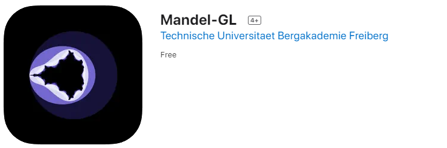
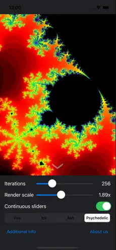
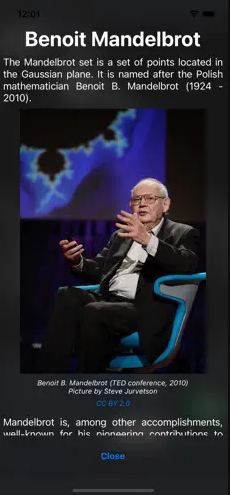
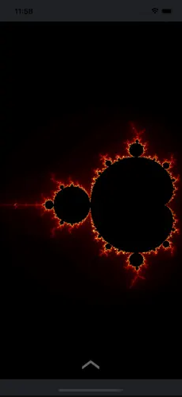

# almond-bread-gl

A GLES3-boosted Mandelbrot renderer for Linux and iOS. Created by the [Technische Universität Bergakademie Freiberg](https://tu-freiberg.de/).

## Appstore

This app can be found [here in the AppStore](https://apps.apple.com/vn/app/mandel-gl/id1230459217?l=en) for iPhone and iPad.

  

## Limitations

This app from 2017 (upgraded to Swift 2022) uses only single precision FP32 in the computational plane, limiting the resolution. An upgrade to 64 would increase the resolution significantly.
